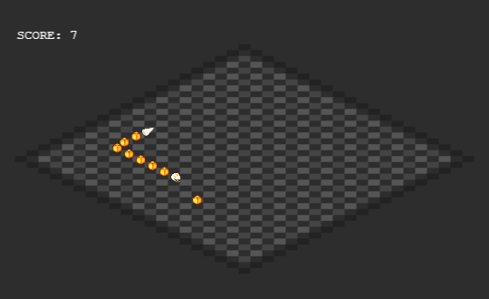

# スネークゲーム

このプロジェクトは [Phaser 3](https://phaser.io/phaser3) を用いて実装された、クォータービュー（斜め見下ろし視点）のスネークゲームです。スマホ対応のバーチャルジョイスティック機能も備えています。



## 🕹️ 特徴

- クォータービュー風の斜め描画
- スマホでのバーチャルジョイスティック対応
- スムーズなスプライト移動（Tween）
- スコア表示と難易度の自動上昇
- 自動レイアウト調整（レスポンシブ）

## 🚀 実行方法

1. このリポジトリをクローンするか ZIP でダウンロード
2. ブラウザで `index.html` を開く

```
git clone https://github.com/onigiri-uma2/snake-game.git
cd quarter-snake-game
open index.html  # またはブラウザで開く
```

## 📁 ディレクトリ構成

```
.
├── index.html              # ゲーム本体
├── assets/                # 画像などの素材（favicon、ヘビの各パーツ）
│   ├── favicon.png
│   ├── snake-head-*.png
│   ├── snake-tail-*.png
│   └── snake-body.png
├── README.md              # このファイル
├── LICENSE                # ライセンス
```

## 📱 スマホ操作について

画面をタップするとバーチャルスティックが表示され、指の動きに応じてヘビを操作できます。

## 🖼️ 素材について

画像素材は自作またはオープンライセンス素材を使用してください。

## 📄 ライセンス

MIT License
